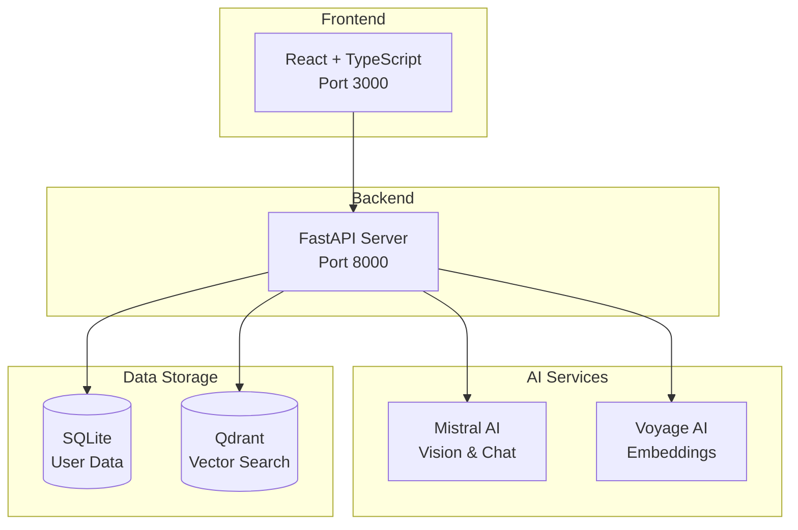

# DIY Visual Finder


A modern web application that helps DIY enthusiasts catalog and search their inventory using AI-powered image analysis and natural language processing. The system combines computer vision, vector similarity search, and conversational AI to provide an intuitive interface for managing your workshop items.


-- This is a small change that has nothing to do with the repo.
## Features

- **AI-Powered Item Recognition**: Upload images of your tools, hardware, or materials and let AI identify and categorize them
- **Visual Search**: Find similar items by uploading a photo of what you're looking for
- **Natural Language Chat**: Ask questions about your inventory in plain English
- **Smart Categorization**: Automatic classification of items into relevant categories
- **Vector-Based Similarity**: Advanced search using multimodal embeddings for accurate results

## Architecture



This is a full-stack polyglot application with:

- **Backend**: Python + FastAPI (port 8000)
- **Frontend**: TypeScript + React + Vite (port 3000)
- **Database**: SQLite (local storage)
- **Vector Store**: Qdrant (cloud-hosted)
- **AI Services**: Mistral AI (vision analysis & chat), Voyage AI (embeddings)

## Quick Start Guide

### Prerequisites

Before running the application, you'll need to set up the following services:

#### 1. Mistral AI API Key
- Visit [Mistral AI Console](https://console.mistral.ai/)
- Create an account and generate an API key
- The application uses Mistral Pixtral for vision analysis and Mistral Large for chat functionality

#### 2. Voyage AI API Key
- Visit [Voyage AI](https://www.voyageai.com/)
- Sign up and obtain an API key
- Used for generating multimodal embeddings for vector search

#### 3. Qdrant Cloud Database
- Visit [Qdrant Cloud](https://cloud.qdrant.io/)
- Create a free cluster
- Note your cluster URL and API key
- The application uses Qdrant for vector similarity search

### Installation

#### Backend Setup

```bash
# Navigate to backend directory
cd backend

# Create virtual environment
python -m venv venv

# Activate virtual environment
# Windows:
venv\Scripts\activate
# macOS/Linux:
source venv/bin/activate

# Install dependencies
pip install -r requirements.txt

# Configure environment variables
# Edit backend/config.py with your API keys:
# - MISTRAL_API_KEY: Your Mistral AI API key
# - VOYAGE_API_KEY: Your Voyage AI API key
# - QDRANT_URL: Your Qdrant cluster URL
# - QDRANT_API_KEY: Your Qdrant API key

# Start the backend server
python app.py
```

#### Frontend Setup

```bash
# Navigate to frontend directory
cd frontend

# Install dependencies
npm install

# Start the development server
npm run dev
```

### First Run

1. **Start Backend**: The FastAPI server will run on `http://localhost:8000`
2. **Start Frontend**: The React app will run on `http://localhost:3000`
3. **Register Account**: Create a new user account through the web interface
4. **Add Items**: Upload images of your tools and materials
5. **Search**: Use the search feature to find items by image or description
6. **Chat**: Ask questions about your inventory using natural language

## Documentation

- [Backend Architecture](docs/backend-architecture.md) - Detailed backend system design and API documentation
- [Frontend Architecture](docs/frontend-architecture.md) - Frontend component structure and state management
- [Database Schemas](docs/database-schemas.md) - SQLite and Qdrant database schemas and relationships

## API Endpoints

### Authentication
- `POST /api/register` - User registration
- `POST /api/login` - User authentication

### Item Management
- `POST /api/items/add` - Add new item with AI analysis
- `GET /api/items/{user_id}` - Get user's items

### Search & Chat
- `POST /api/search` - Visual similarity search
- `POST /api/chat` - Natural language queries

## Technology Stack

### Backend
- **FastAPI** - Modern Python web framework
- **SQLite** - Local relational database
- **Qdrant** - Vector database for similarity search
- **Mistral AI** - Vision analysis and chat functionality
- **Voyage AI** - Multimodal embeddings

### Frontend
- **React 18** - User interface framework
- **TypeScript** - Type-safe JavaScript
- **Vite** - Build tool and development server
- **Tailwind CSS** - Utility-first CSS framework
- **Radix UI** - Accessible component primitives

## Development

### Running Tests

```bash
# Backend tests
cd backend
python -m pytest unitTests/
```

### Code Quality

The project includes AST-grep rules for detecting common issues:

```bash
# Install AST-grep
npm install -g @ast-grep/cli

# Run quality checks
ast-grep scan --rule rules/ backend/
ast-grep scan --rule rules/ frontend/
```

## License

This project is licensed under the MIT License - see the LICENSE file for details.
