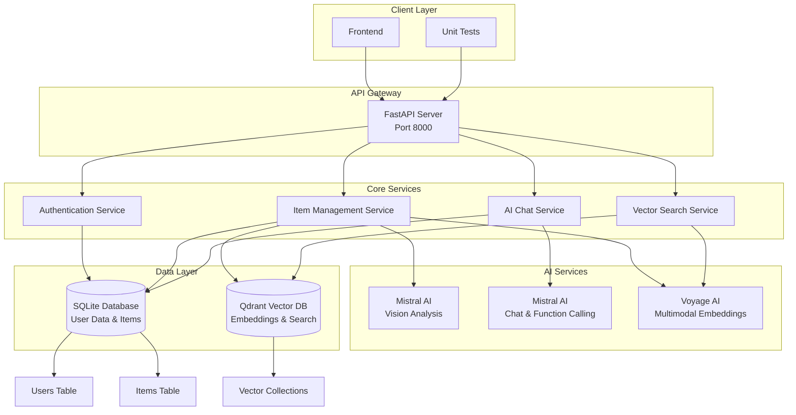
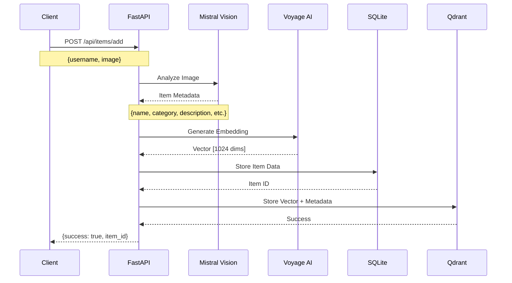
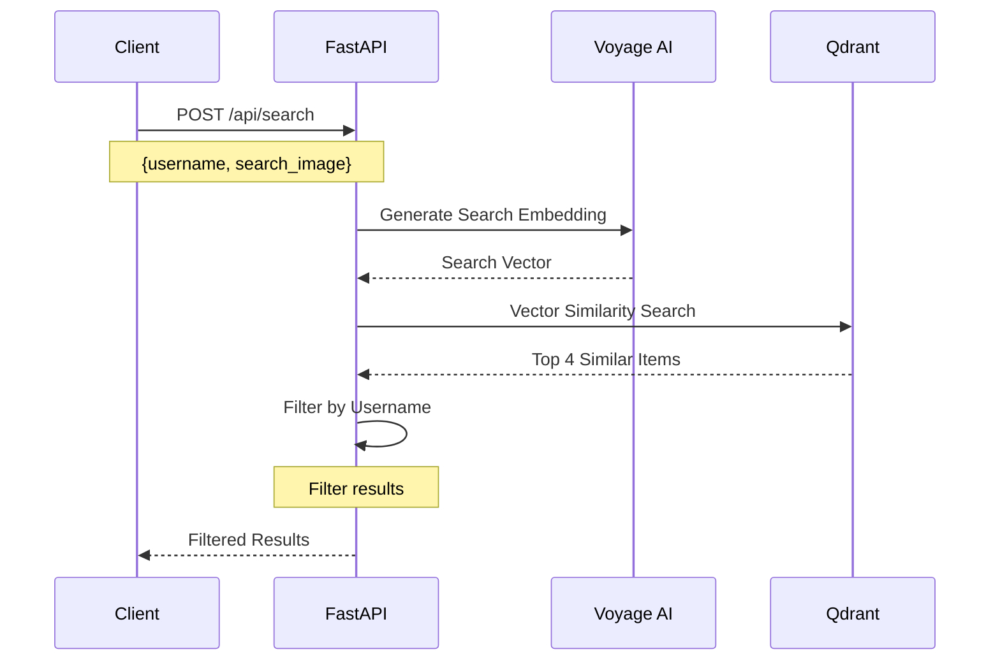
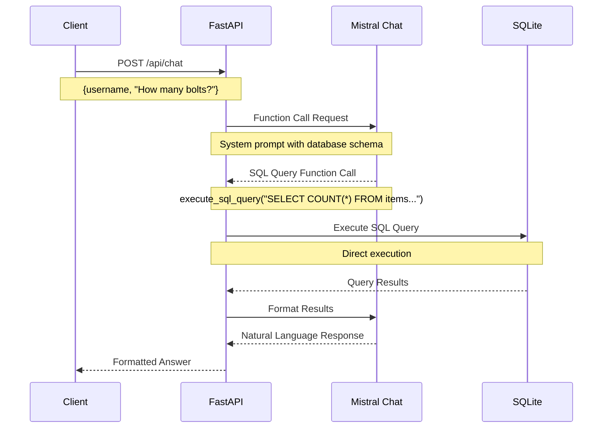

# DIY Visual Finder - Backend Architecture

## Overview

The DIY Visual Finder is a FastAPI-based backend service that enables users to catalog and search their DIY inventory using AI-powered image analysis and vector similarity search. The system integrates multiple AI services and databases to provide intelligent item recognition, natural language chat, and semantic search capabilities.

## System Architecture



## API Endpoints

### Authentication Endpoints

#### `POST /api/register`
**Purpose:** User registration with account creation  
**Request Body:**
```json
{
  "username": "string",
  "password": "string", 
  "email": "string",
  "phone_number": "string",
  "full_name": "string",
  "address": "string"
}
```
**Response:**
```json
{
  "success": true,
  "user": {
    "id": 1,
    "username": "john_doe",
    "email": "john@example.com"
  }
}
```

#### `POST /api/login`
**Purpose:** User authentication and session management  
**Request Body:**
```json
{
  "username": "string",
  "password": "string"
}
```
**Response:**
```json
{
  "success": true,
  "user": {
    "id": 1,
    "username": "john_doe",
    "email": "john@example.com"
  },
  "token": "jwt_token_here"
}
```

### Item Management Endpoints

#### `POST /api/items/add`
**Purpose:** Add new item with AI-powered image analysis  
**Request Body:**
```json
{
  "username": "string",
  "image": "data:image/jpeg;base64,..."
}
```
**Response:**
```json
{
  "success": true,
  "item_id": 123
}
```
**AI Processing Flow:**
1. Mistral Pixtral analyzes image for item identification
2. Voyage AI generates multimodal embeddings
3. Item stored in SQLite with metadata
4. Vector stored in Qdrant for similarity search

#### `GET /api/items/{user_id}`
**Purpose:** Retrieve all items for a specific user  
**Response:**
```json
{
  "items": [
    {
      "id": 1,
      "name": "M6 Hex Bolts",
      "category": "fasteners",
      "quantity": 10,
      "location": "Workshop"
    }
  ]
}
```

### Search Endpoints

#### `POST /api/search`
**Purpose:** Find similar items using image-based vector search  
**Request Body:**
```json
{
  "username": "string",
  "image": "data:image/jpeg;base64,..."
}
```
**Response:**
```json
{
  "success": true,
  "results": [
    {
      "id": 123,
      "score": 0.95,
      "name": "M6 Hex Bolts",
      "category": "fasteners",
      "description": "Stainless steel hex bolts",
      "quantity": 10,
      "location": "Workshop",
      "image_data": "data:image/jpeg;base64,..."
    }
  ]
}
```

### Chat Endpoints

#### `POST /api/chat`
**Purpose:** Natural language interface for database queries  
**Request Body:**
```json
{
  "username": "string",
  "text": "How many M6 screws do I have?"
}
```
**Response:**
```json
{
  "response": "You have 15 M6 screws in your Workshop inventory."
}
```
**AI Processing Flow:**
1. Mistral AI with function calling generates SQL queries
2. SQL executed directly against SQLite database
3. Results formatted and returned to user

### Health Check

#### `GET /`
**Purpose:** API health check and status  
**Response:**
```json
{
  "message": "DIY Visual Finder API is running"
}
```

## Data Flow Diagrams

### Item Addition Flow


### Search Flow


### Chat Flow


## Database Schema

### SQLite Database

#### Users Table
```sql
CREATE TABLE users (
    id INTEGER PRIMARY KEY,
    username TEXT UNIQUE,
    password TEXT, 
    email TEXT,
    phone_number TEXT,
    full_name TEXT,
    address TEXT
);
```

#### Items Table
```sql
CREATE TABLE items (
    id INTEGER PRIMARY KEY,
    user_id TEXT, 
    name TEXT,
    category TEXT,
    description TEXT,
    quantity INTEGER DEFAULT 1,
    location TEXT,
    storage_box TEXT,
    brand TEXT,
    size TEXT,
    condition TEXT,
    purchase_date TEXT,
    image_data TEXT, 
    metadata TEXT, 
    created_at TIMESTAMP,
    last_updated TIMESTAMP
);
```

### Qdrant Vector Database

#### Items Collection
- **Vector Size:** 1024 dimensions (Voyage AI multimodal embeddings)
- **Distance Metric:** Cosine similarity
- **Payload Fields:**
  - `username` - User identifier
  - `name` - Item name
  - `category` - Item category
  - `description` - Item description
  - `quantity` - Item quantity
  - `location` - Storage location
  - `image_data` - Base64 image data

## Technology Stack

### Core Framework
- **FastAPI** - Modern Python web framework
- **Uvicorn** - ASGI server
- **Pydantic** - Data validation and serialization

### AI Services
- **Mistral AI**
  - Pixtral Large - Vision analysis and item identification
  - Mistral Large - Chat and function calling
- **Voyage AI** - Multimodal embeddings (text + image)

### Databases
- **SQLite** - Relational data storage
- **Qdrant** - Vector database for similarity search

### Python Libraries
- `mistralai` - Mistral AI Python client
- `voyageai` - Voyage AI Python client
- `qdrant-client` - Qdrant vector database client
- `requests` - HTTP client for API calls
- `pillow` - Image processing

## Performance Considerations

### Optimization Strategies
- **Async Operations** - Non-blocking AI service calls
- **Connection Pooling** - Efficient database connections
- **Caching** - Response caching for repeated requests
- **Batch Processing** - Bulk operations for multiple items

### Scalability Features
- **Horizontal Scaling** - Stateless API design
- **Database Optimization** - Indexed queries and efficient schemas
- **Vector Search** - Optimized similarity search algorithms
- **Load Balancing** - Multiple server instances support

## Security Implementation

### Authentication
- **JWT Tokens** - Secure session management
- **Password Hashing** - bcrypt for password security
- **Input Validation** - Pydantic model validation

### Data Protection
- **User Isolation** - Data access restricted by username
- **API Key Management** - Secure credential storage
- **HTTPS** - Encrypted communication

## Error Handling

### API Error Responses
```json
{
  "error": "string",
  "message": "string",
  "status_code": 400
}
```

### Exception Handling
- **Validation Errors** - Pydantic validation failures
- **Database Errors** - SQLite connection issues
- **AI Service Errors** - API timeout and rate limiting
- **Vector Search Errors** - Qdrant connection failures

## Monitoring and Logging

### Application Metrics
- **Request/Response Times** - API performance tracking
- **Error Rates** - Failure monitoring
- **AI Service Usage** - Token consumption tracking
- **Database Performance** - Query execution times

### Logging Strategy
- **Structured Logging** - JSON-formatted logs
- **Log Levels** - DEBUG, INFO, WARNING, ERROR
- **Request Tracing** - End-to-end request tracking
- **Performance Metrics** - Response time logging

## Testing Strategy

### Unit Tests
- **API Endpoint Testing** - Individual endpoint validation
- **Database Operations** - CRUD operation testing
- **AI Service Integration** - Mock service testing
- **Error Handling** - Exception scenario testing

### Integration Tests
- **End-to-End Flows** - Complete user journey testing
- **Database Integration** - SQLite and Qdrant testing
- **AI Service Integration** - Real service testing
- **Performance Testing** - Load and stress testing

## Deployment Configuration

### Environment Variables
```bash
MISTRAL_API_KEY=your_mistral_key
VOYAGE_API_KEY=your_voyage_key
QDRANT_URL=your_qdrant_url
QDRANT_API_KEY=your_qdrant_key
DATABASE_PATH=data/diy_finder.db
HOST=0.0.0.0
PORT=8000
```

### Docker Configuration
```dockerfile
FROM python:3.11-slim
WORKDIR /app
COPY requirements.txt .
RUN pip install -r requirements.txt
COPY . .
EXPOSE 8000
CMD ["uvicorn", "app:app", "--host", "0.0.0.0", "--port", "8000"]
```

## Maintenance and Updates

### Database Migrations
- **Schema Updates** - Version-controlled database changes
- **Data Migration** - Safe data transformation
- **Backup Strategy** - Regular database backups

### AI Service Updates
- **Model Versioning** - AI model update management
- **API Versioning** - Backward compatibility maintenance
- **Performance Monitoring** - AI service quality tracking
