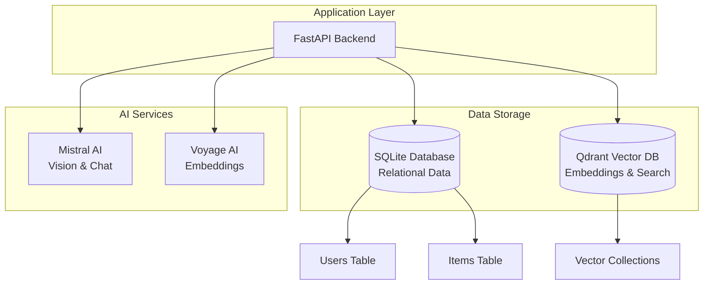
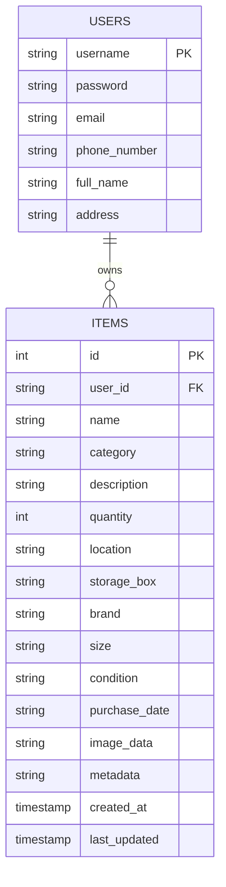
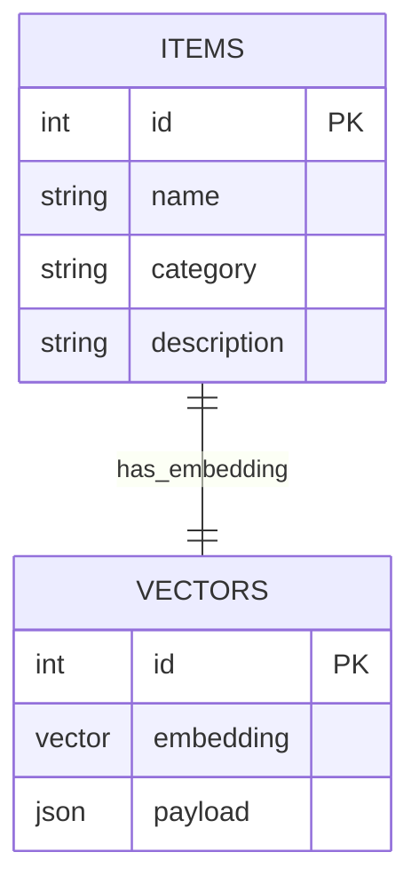

# DIY Visual Finder - Database Schemas

## Overview

The DIY Visual Finder application uses a hybrid database architecture combining SQLite for relational data storage and Qdrant for vector similarity search. This design provides both structured data management and advanced AI-powered search capabilities.

## Database Architecture



## SQLite Database Schema

### Users Table

Stores user account information and authentication data.

```sql
CREATE TABLE users (
    id INTEGER PRIMARY KEY,
    username TEXT UNIQUE NOT NULL,
    password TEXT NOT NULL,
    email TEXT,
    phone_number TEXT,
    full_name TEXT,
    address TEXT
);
```

#### Field Descriptions

| Field | Type | Description | Constraints |
|-------|------|-------------|-------------|
| `id` | INTEGER | Primary key, auto-increment | PRIMARY KEY |
| `username` | TEXT | Unique username for login | UNIQUE, NOT NULL |
| `password` | TEXT | Hashed password | NOT NULL |
| `email` | TEXT | User email address | Optional |
| `phone_number` | TEXT | Contact phone number | Optional |
| `full_name` | TEXT | User's full name | Optional |
| `address` | TEXT | User's address | Optional |

#### Sample Data

```sql
INSERT INTO users (username, password, email, phone_number, full_name, address) 
VALUES ('john_doe', 'hashed_password', 'john@example.com', '555-0123', 'John Doe', '123 Main St');
```

### Items Table

Stores detailed information about user's DIY inventory items.

```sql
CREATE TABLE items (
    id INTEGER PRIMARY KEY,
    user_id TEXT NOT NULL,
    name TEXT NOT NULL,
    category TEXT,
    description TEXT,
    quantity INTEGER DEFAULT 1,
    location TEXT,
    storage_box TEXT,
    brand TEXT,
    size TEXT,
    condition TEXT,
    purchase_date TEXT,
    image_data TEXT,
    metadata TEXT,
    created_at TIMESTAMP DEFAULT CURRENT_TIMESTAMP,
    last_updated TIMESTAMP DEFAULT CURRENT_TIMESTAMP
);
```

#### Field Descriptions

| Field | Type | Description | Constraints |
|-------|------|-------------|-------------|
| `id` | INTEGER | Primary key, auto-increment | PRIMARY KEY |
| `user_id` | TEXT | Foreign key to users.username | NOT NULL |
| `name` | TEXT | Item name (AI-generated) | NOT NULL |
| `category` | TEXT | Item category (AI-generated) | Optional |
| `description` | TEXT | Detailed description (AI-generated) | Optional |
| `quantity` | INTEGER | Number of items | DEFAULT 1 |
| `location` | TEXT | Storage location | Optional |
| `storage_box` | TEXT | Specific storage container | Optional |
| `brand` | TEXT | Item brand/manufacturer | Optional |
| `size` | TEXT | Item dimensions/size | Optional |
| `condition` | TEXT | Item condition | Optional |
| `purchase_date` | TEXT | Date of purchase | Optional |
| `image_data` | TEXT | Base64 encoded image | Optional |
| `metadata` | TEXT | JSON metadata from AI analysis | Optional |
| `created_at` | TIMESTAMP | Record creation time | DEFAULT CURRENT_TIMESTAMP |
| `last_updated` | TIMESTAMP | Last modification time | DEFAULT CURRENT_TIMESTAMP |

#### Sample Data

```sql
INSERT INTO items (
    user_id, name, category, description, quantity, location, 
    storage_box, brand, size, condition, image_data, metadata
) VALUES (
    'john_doe', 
    'M6 Hex Bolts', 
    'fasteners', 
    'Stainless steel hex bolts with metric threading', 
    10, 
    'Workshop', 
    'Hardware Box A', 
    'Generic', 
    'M6 x 20mm', 
    'New', 
    'data:image/jpeg;base64,/9j/4AAQSkZJRgABAQAAAQ...',
    '{"confidence": 0.95, "ai_model": "mistral-pixtral"}'
);
```

## Qdrant Vector Database Schema

### Collection Configuration

The Qdrant database uses a single collection for storing item embeddings and metadata.

#### Collection Parameters

```python
collection_name = "items"
vector_size = 1024  # Voyage AI multimodal embedding dimensions
distance_metric = "COSINE"  # Cosine similarity for vector search
```

#### Vector Structure

Each item is stored as a point in the vector database with:

- **ID**: Corresponds to the SQLite items.id
- **Vector**: 1024-dimensional embedding from Voyage AI
- **Payload**: Metadata for filtering and display

### Payload Schema

```json
{
  "name": "string",           // Item name
  "category": "string",       // Item category
  "description": "string",    // Item description
  "quantity": "integer",      // Item quantity
  "location": "string",       // Storage location
  "storage_box": "string",    // Storage container
  "brand": "string",          // Item brand
  "size": "string",           // Item size/dimensions
  "condition": "string",      // Item condition
  "image_data": "string",     // Base64 image data
  "username": "string"        // Owner username for filtering
}
```

#### Sample Vector Point

```python
{
    "id": 123,
    "vector": [0.1, -0.2, 0.3, ..., 0.8],  # 1024 dimensions
    "payload": {
        "name": "M6 Hex Bolts",
        "category": "fasteners",
        "description": "Stainless steel hex bolts with metric threading",
        "quantity": 10,
        "location": "Workshop",
        "storage_box": "Hardware Box A",
        "brand": "Generic",
        "size": "M6 x 20mm",
        "condition": "New",
        "image_data": "data:image/jpeg;base64,/9j/4AAQSkZJRgABAQAAAQ...",
        "username": "john_doe"
    }
}
```

## Data Relationships

### User-Item Relationship



### Vector-Item Relationship



## Data Flow

### Item Addition Process

1. **Image Upload**: User uploads image via frontend
2. **AI Analysis**: Mistral Pixtral analyzes image and extracts metadata
3. **Embedding Generation**: Voyage AI creates multimodal embedding
4. **SQLite Storage**: Item data stored in SQLite database
5. **Vector Storage**: Embedding and metadata stored in Qdrant
6. **Response**: Item ID returned to frontend

### Search Process

1. **Search Image**: User uploads search image
2. **Embedding Generation**: Voyage AI creates search embedding
3. **Vector Search**: Qdrant performs similarity search
4. **User Filtering**: Results filtered by username
5. **Data Enrichment**: SQLite data merged with vector results
6. **Response**: Ranked results returned to frontend

### Chat Process

1. **Query**: User sends natural language query
2. **Function Calling**: Mistral AI generates SQL query
3. **Database Query**: SQL executed against SQLite
4. **Response Formatting**: Results formatted by AI
5. **Response**: Natural language answer returned

## Indexing Strategy

### SQLite Indexes

```sql
-- Username index for fast user lookups
CREATE INDEX idx_users_username ON users(username);

-- User items index for fast item retrieval
CREATE INDEX idx_items_user_id ON items(user_id);

-- Category index for filtering
CREATE INDEX idx_items_category ON items(category);

-- Name index for text search
CREATE INDEX idx_items_name ON items(name);
```

### Qdrant Indexing

- **Vector Index**: HNSW (Hierarchical Navigable Small World) for fast similarity search
- **Payload Index**: Inverted index for metadata filtering
- **Username Filter**: Optimized for user-specific searches

## Data Consistency

### Synchronization

- **Bidirectional Sync**: Changes in SQLite trigger Qdrant updates
- **Atomic Operations**: Item addition is atomic across both databases
- **Error Handling**: Rollback mechanisms for failed operations

### Data Integrity

- **Foreign Key Constraints**: User validation before item creation
- **Vector Validation**: Embedding dimension validation
- **Metadata Validation**: JSON schema validation for payload

## Performance Considerations

### SQLite Optimization

- **Connection Pooling**: Reused database connections
- **Prepared Statements**: Parameterized queries for security
- **Batch Operations**: Bulk inserts for multiple items

### Qdrant Optimization

- **Vector Compression**: Quantization for storage efficiency
- **Payload Filtering**: Efficient username-based filtering
- **Batch Upserts**: Bulk vector operations

## Backup and Recovery

### SQLite Backup

```bash
# Create backup
sqlite3 diy_finder.db ".backup backup.db"

# Restore from backup
sqlite3 diy_finder.db ".restore backup.db"
```

### Qdrant Backup

```python
# Snapshot creation
qdrant_client.create_snapshot(collection_name="items")

# Snapshot restoration
qdrant_client.restore_snapshot(collection_name="items", snapshot_name="backup")
```

## Security Considerations

### Data Protection

- **Password Hashing**: bcrypt for password storage
- **Input Validation**: SQL injection prevention
- **Access Control**: User-based data isolation

### Vector Security

- **User Filtering**: All searches filtered by username
- **API Key Management**: Secure credential storage
- **Network Security**: HTTPS for all communications

## Monitoring and Maintenance

### Database Health

- **Connection Monitoring**: Active connection tracking
- **Query Performance**: Slow query identification
- **Storage Usage**: Database size monitoring

### Vector Database Health

- **Collection Status**: Collection health monitoring
- **Search Performance**: Query latency tracking
- **Storage Metrics**: Vector storage utilization

## Migration Strategy

### Schema Evolution

- **Version Control**: Database schema versioning
- **Migration Scripts**: Automated schema updates
- **Backward Compatibility**: Graceful degradation

### Data Migration

- **Export/Import**: JSON-based data portability
- **Vector Migration**: Embedding regeneration for schema changes
- **Validation**: Data integrity verification
